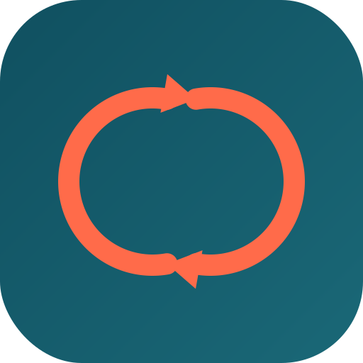

  

<h1 align="center">FG Backend LangSwitcher</h1>

  
  
  
  

Lets every administrator switch their own backend (admin panel) language
in one click — without touching the site's global language settings and
without needing another admin's permission to change it back.

By default the switch is **temporary**: it lasts until you log out, and
never writes to your user profile. An optional setting makes it
**permanent** instead, saving the choice to your profile's
`admin_language` parameter — exactly like Joomla's own "My Profile" screen
would.

## Why

Joomla's own core has no per-request, no-permission-needed way for a
logged-in administrator to preview or temporarily work in a different
backend language. The only built-in option is permanently changing your
profile's language — which is overkill if you just need to check how a
translated string looks, or occasionally help out in another language for
a few minutes.

## Features

- **Temporary or permanent switching**, your choice, per module instance.
- **Dropdown or inline** display style.
- Shows the **native language name**, the language **code**, or both.
- **Customisable icon** (any Joomla icon alias or Font Awesome class) —
  no code changes needed.
- Locale-independent **alphabetical sorting** of the language list (ICU
  `Collator`, with a `strcoll()` fallback if `ext-intl` isn't available).
- **"Default (site setting)"** option to reset back to the site's actual
  default admin language, correctly distinguished from your own persisted
  profile preference.
- Hidden automatically on the **login screen** (nothing to switch there).
- On **first install**, automatically creates a published module instance
  in the admin header's status area — nothing to configure by hand.
- Companion system plugin needed only for temporary-mode switching; it
  self-enables on first install.
- Errors (invalid token, plugin disabled, language not installed, profile
  save failure) are logged to a dedicated log file and always leave you
  with a clean URL, never a stuck/repeatable failed action.

## How it works

Two extensions, installed together as one package:

- **`mod_fgbackendlangswitcher`** — the module: renders the switcher UI in
  the admin header and, on a permanent switch, saves the choice to the
  current user's `admin_language` profile parameter.
- **`plg_system_fgbackendlangswitcher`** — a system plugin that applies a
  *temporary* (session-only) language choice on `onAfterInitialise`, early
  enough that the rest of the admin request (including the left-hand menu)
  renders in the chosen language. Only needed for temporary-mode
  switching; permanent switching works without it.

## Installation

1. Download the latest release ZIP from the
   [Releases](https://github.com/ferino75/pkg_fgbackendlangswitcher/releases)
   page.
2. In Joomla, go to **System → Install → Extensions → Upload & Install**
   and upload the ZIP.
3. That's it — a published module instance is created automatically on
   first install, in the admin header's status position. The companion
   plugin enables itself automatically too.

## Configuration

Open the module instance (**Content → Site Modules → Backend
LangSwitcher**, filtered to Administrator) to adjust:

| Setting | Description |
|---|---|
| Display style | Dropdown or inline list |
| Show native name | Native vs. English language name |
| Show language code | e.g. `(sk-SK)` |
| Show 'Default' option | Offer a reset-to-site-default entry |
| Icon CSS class | Any Joomla icon alias or Font Awesome class |
| Save permanently to profile | Off by default (temporary/session-only) |

## Updates

This extension ships with a Joomla update server
([`updates.xml`](updates.xml)), so new versions show up under **System →
Update → Extensions** once installed.

## Changelog

See [`mod_fgbackendlangswitcher/CHANGELOG.md`](mod_fgbackendlangswitcher/CHANGELOG.md)
and [`plg_system_fgbackendlangswitcher/CHANGELOG.md`](plg_system_fgbackendlangswitcher/CHANGELOG.md).

## License

[GPL-2.0-or-later](LICENSE), same as Joomla itself.
